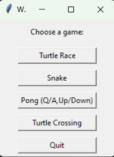

# Introducing Collection of Games
**Collection of Games** is a Python GUI application, inspired by the [100 Days of Code](https://www.udemy.com/course/100-days-of-code/) online course, that lets you play one of the following games: Turtle Race, Snake, Pong, Turtle Crossing.

# Features
## Explain me the GUI
After running `main.py`, you see the main menu from which you can select one of the four games:
 

Please see the description of the individual games below.
### Turtle Race
You need to guess which of the 6 turtles will win the race by typing its color ("red","orange","yellow","green","blue","purple"). If you guess the color of the winning turtle, you win!

### Snake
Use arrows to find and eat the food for your snake. After each game, your current score is written into the 'snake_score.txt' file in the program folder so that you know what score you achieved when.

### Pong
For 2 players. One player uses arrows key (UP/DOWN), the other player uses Q/A key for control. The ball speed increases over time.

### Turtle Crossing
Using the UP arrow key, your goal is to make the turtle get safely to the other side of the street. Careful, the density of the traffic and its speed increases with each level.

# Installation and Setup
- Download the entire project code to your computer and unzip files locally.
- Run `main.py` with Python
